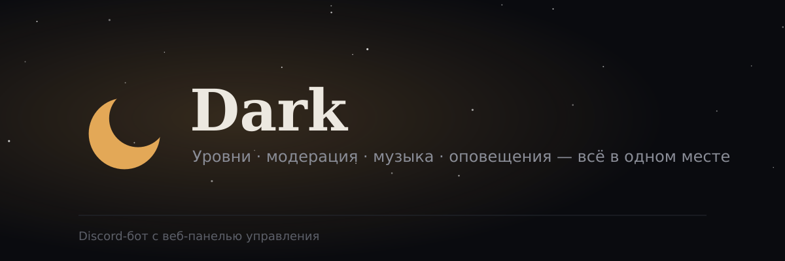

<p align="center">
  
</p>

<p align="center">
  
  
  
  
</p>

# Dark

Discord-бот с веб-панелью. Команд мало, возможностей много: всё спрятано в подкоманды,
а то же самое можно настроить в браузере после входа через Discord.

- **Профиль-карточка и таблица лидеров** — красивые изображения: уровень, опыт, место на сервере, баланс
- **Экономика** — ежедневная награда, переводы
- **Музыка** — YouTube, SoundCloud, ссылки Spotify (через поиск на YouTube); бот сам выходит из голосового после 5 минут простоя
- **Модерация и автомодерация** — предупреждения, мут, бан, журнал, жалобы на сообщения
- **Сервер** — роли по реакциям, автороль, приветствия, временные голосовые каналы, свои команды
- **Оповещения** о видео на YouTube и стримах Twitch
- **Веб-панель** — тёмная тема, вход через Discord, HTTPS

## Команды

Всего 9 команд. Наберите `/`, и Discord покажет подкоманды.

**Для участников**

| Команда | Действие |
|---|---|
| `/profile view` · `top` | Карточка профиля и таблица лидеров (изображения) |
| `/economy daily` · `pay` | Награда раз в сутки и перевод монет |
| `/music play` · `panel` · `queue` | Музыка в голосовом канале. Управление кнопками на панели: пауза, пропуск, стоп, громкость |
| `/help` | Список команд |
| Меню сообщения → **Пожаловаться на сообщение** | Жалоба модераторам |

**Для администрации** (нужны права в Discord)

| Команда | Действие |
|---|---|
| `/moderation` | `warn` `unwarn` `warnings` `mute` `unmute` `kick` `ban` `unban` `clear` |
| `/manage` | `command`, `reactionrole`, `tempvoice`, `alert` |
| `/settings` | Каналы логов и жалоб, приветствие, автороль, префикс, название валюты |
| `/automod` | Запрещённые слова, инвайты, антиспам |

## Быстрый старт

### 1. Приложение в Discord

1. [Developer Portal](https://discord.com/developers/applications) → **New Application**.
2. **Bot** → **Reset Token** → это `DISCORD_TOKEN`.
3. В **Privileged Gateway Intents** включите **Server Members** и **Message Content**.
   Без них бот не запустится (`Used disallowed intents`).
4. **OAuth2** → скопируйте **Client ID** и **Client Secret**.
5. **OAuth2 → Redirects** → добавьте `https://ВАШ_ДОМЕН:8843/auth/callback`.
6. Пригласите бота (scopes `bot` и `applications.commands`):
   ```
   https://discord.com/oauth2/authorize?client_id=ВАШ_CLIENT_ID&scope=bot%20applications.commands&permissions=1099800079446
   ```

Роль бота должна стоять выше ролей, которыми он управляет.

### 2. Сервер (Ubuntu)

```bash
sudo apt update
sudo apt install -y git ffmpeg python3 build-essential nginx certbot
```

Node.js 20 или новее:

```bash
curl -fsSL https://deb.nodesource.com/setup_22.x | sudo -E bash -
sudo apt install -y nodejs
```

yt-dlp (нужен для музыки):

```bash
sudo curl -L https://github.com/yt-dlp/yt-dlp/releases/latest/download/yt-dlp -o /usr/local/bin/yt-dlp
sudo chmod a+rx /usr/local/bin/yt-dlp
```

Проект:

```bash
cd /opt
git clone git@github.com:ВАШ_АККАУНТ/ВАШ_РЕПОЗИТОРИЙ.git dark-bot
cd dark-bot
npm install
cp .env.example .env
nano .env
npm run deploy-commands
```

Запуск:

```bash
sudo npm install -g pm2
pm2 start ecosystem.config.js
pm2 save
pm2 startup
```

### 3. Файл `.env`

```env
DISCORD_TOKEN=
DISCORD_CLIENT_ID=
DISCORD_CLIENT_SECRET=

# ID вашего сервера: команды появятся сразу.
# Если пусто, команды станут глобальными (до часа).
DEV_GUILD_ID=

WEB_PORT=3000
WEB_BASE_URL=https://ВАШ_ДОМЕН:8843
SESSION_SECRET=      # openssl rand -hex 32
BOT_OWNER_IDS=       # ваш Discord ID

DATABASE_PATH=./data/dark.sqlite

# необязательно
YOUTUBE_API_KEY=
TWITCH_CLIENT_ID=
TWITCH_CLIENT_SECRET=
ALERT_POLL_INTERVAL_MINUTES=5
```

- `WEB_PORT` — внутренний порт панели. Не ставьте туда 8843 или 8880: их занимает nginx.
- `WEB_BASE_URL` должен начинаться с `https://`, иначе вход через Discord не сохранит сессию.
- После правки `.env`: `pm2 restart all --update-env`.

### 4. HTTPS на нестандартных портах

Порты 80 и 443 не нужны: **8843** отдаёт HTTPS, **8880** перенаправляет на него.

```
Браузер → https:8843 → nginx → панель (localhost:3000)
```

<details>
<summary>Сертификат Let's Encrypt через DNS (DuckDNS или другой домен)</summary>

```bash
sudo certbot certonly --manual --preferred-challenges dns -d ВАШ_ДОМЕН
```

Сертификат ляжет в `/etc/letsencrypt/live/ВАШ_ДОМЕН/`. Для DuckDNS TXT-запись ставится запросом
`https://www.duckdns.org/update?domains=ИМЯ&token=ТОКЕН&txt=ЗНАЧЕНИЕ` — его можно вынести в
`--manual-auth-hook` и `--manual-cleanup-hook`, тогда продление пройдёт без участия человека.
Токен DuckDNS секретный: если он попал в чат или скриншот, перевыпустите его на сайте.

</details>

<details>
<summary>Конфиг nginx</summary>

Файл `/etc/nginx/conf.d/dark-bot.conf`:

```nginx
server {
    listen 8880;
    server_name ВАШ_ДОМЕН;
    return 301 https://$host:8843$request_uri;
}

server {
    listen 8843 ssl;
    server_name ВАШ_ДОМЕН;

    ssl_certificate     /etc/letsencrypt/live/ВАШ_ДОМЕН/fullchain.pem;
    ssl_certificate_key /etc/letsencrypt/live/ВАШ_ДОМЕН/privkey.pem;

    location / {
        proxy_pass http://localhost:3000;
        proxy_http_version 1.1;
        proxy_set_header Upgrade $http_upgrade;
        proxy_set_header Connection 'upgrade';
        proxy_set_header Host $host;
        proxy_set_header X-Real-IP $remote_addr;
        proxy_set_header X-Forwarded-For $proxy_add_x_forwarded_for;
        proxy_set_header X-Forwarded-Proto $scheme;
    }
}
```

```bash
sudo nginx -t && sudo systemctl restart nginx
sudo ufw allow 8880/tcp    # если включён ufw
sudo ufw allow 8843/tcp
```

</details>

Панель: **https://ВАШ_ДОМЕН:8843**

## Обновление через GitHub

Код попадает на сервер только через GitHub.

1. В GitHub Desktop проверьте, что в списке изменений есть все файлы (в том числе `package.json`).
2. **Commit to main**, затем отдельно **Push origin**.
3. Убедитесь на github.com, что файлы обновились.
4. На сервере:

```bash
cd /opt/dark-bot
git pull
npm install
pm2 restart dark-bot dark-web
```

`npm run deploy-commands` нужен только если менялся набор команд или подкоманд.

Если `git pull` отказывается из-за `package.json` или `package-lock.json`:

```bash
git checkout -- package.json
rm -f package-lock.json
git pull
```

Чтобы это не повторялось, добавьте `package-lock.json` в `.gitignore`.

## Веб-панель

Вход через Discord. Видны серверы, где у вас есть право управления.

Разделы: обзор, уровни, лидерборд, модерация, автомодерация, приветствие и автороль,
роли по реакциям, свои команды, временные голосовые, оповещения.

Панель и бот используют одну базу SQLite, поэтому настройки применяются сразу, без перезапуска.

## Оповещения YouTube и Twitch

- YouTube: ключ YouTube Data API v3 из Google Cloud Console → `YOUTUBE_API_KEY`. Канал указывается по ID вида `UCxxxxxxxxxxxxxxxxxxxxxx` (регистр важен). Проверка идёт через список загрузок канала и почти не расходует дневную квоту.
- Twitch: приложение на dev.twitch.tv/console → `TWITCH_CLIENT_ID` и `TWITCH_CLIENT_SECRET`.

Без ключей подкоманды `/manage alert` сообщат, что интеграция не настроена. Остальной бот работает.

## Если что-то не работает

| Симптом | Что делать |
|---|---|
| Бот не в сети, в логе `Used disallowed intents` | Включить Server Members и Message Content в Developer Portal, затем `pm2 restart dark-bot` |
| Команд нет в списке | `npm run deploy-commands`, перезапустить Discord (Ctrl+R), проверить scope `applications.commands` у приглашения |
| Команды задвоились | Остались глобальные и серверные регистрации. Оставьте один способ: задайте `DEV_GUILD_ID`, очистите глобальные и снова `deploy-commands` |
| Изменений нет на сервере | Закоммичено → Push origin → видно на github.com → `git pull` → `pm2 restart` |
| `Cannot find module …` или `X.init is not a function` | `pm2 stop all && rm -rf node_modules package-lock.json && npm install && pm2 restart all` |
| Музыка: «Не удалось воспроизвести» | Проверить `yt-dlp --version`, `ffmpeg -version`; в `package.json` должен быть `@discordjs/opus`; обновить `sudo yt-dlp -U`; смотреть `pm2 logs dark-bot --lines 60` |
| Панель не открывается | `sudo nginx -t`; `WEB_PORT` должен быть 3000; порты: `sudo ss -tlnp \| grep -E '8843\|8880\|3000'` |
| `redirect_uri` при входе | Redirect в Developer Portal должен точно совпадать с `WEB_BASE_URL` + `/auth/callback` |

## Ограничения

- Spotify и Яндекс.Музыка напрямую не играют: по ссылке Spotify бот берёт название трека и ищет звук на YouTube.
- Оповещения работают опросом раз в `ALERT_POLL_INTERVAL_MINUTES` минут.
- Опыт начисляется только за текстовые сообщения.

## Проверка перед выпуском

В папке `test_harness/` лежат тесты на имитации Discord (без реального токена):

```bash
node test_harness/run.js           # команды
node test_harness/run_events.js    # события
```

## Структура

```
assets/             баннер и логотип
bot/
  commands/         слэш-команды по категориям
  events/           события Discord
  modules/          уровни, automod, rankCard, музыка, оповещения
  utils/            эмбеды, права, журнал модерации
  assets/fonts/     шрифты для карточки профиля
db/                 модели Sequelize
web/                панель: routes, views (EJS), public
ecosystem.config.js
Dockerfile, docker-compose.yml
```

## Лицензия

MIT
